# Chapter 9 I/O

## Overview

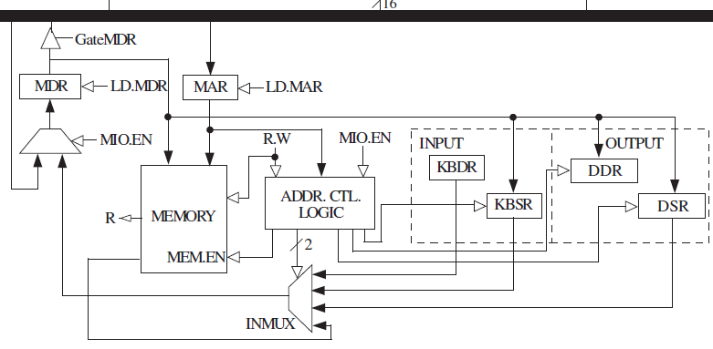

TRAP instruction: system call. TRAP is calling on the operating system to do something for us while allowing us not to understand the details on how it is realized. 

The prompt of OS: enable us to utilize the resources of the computers and prevent us from doing something harmful to the computer or data (by privilege). 

## Privilege, Priority, Memory Address Space

### Privilege

The right to execute instructions or access particular memories. Every program is designated as privileged or unprivileged.

- Not all computer programs have the right to execute all instructions (like HALT) nor access all the memories. Some memory are only available to the OS.

- Privileged: Supervisor privilege, supervisor mode. It can execute all instructions and access all the memories.
- Unprivileged: User Mode.

### Priority

A program with low priority would be interrupted by higher ones. 

### PSR (Processor Status Register)

A program would associate with two important registers: PC and PSR.

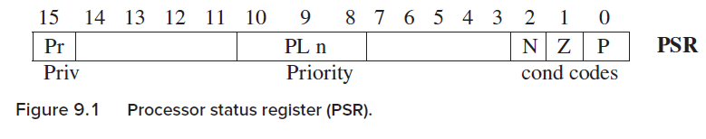

- PSR[15]: Privilege. PSR[15] = 1, unprivileged, user mode; PSR[15] = 0, privileged, Supervisor mode.
- PSR[10:8]: Priority. PL0 ~ PL7.
- Condition codes.

### Organization of Memory

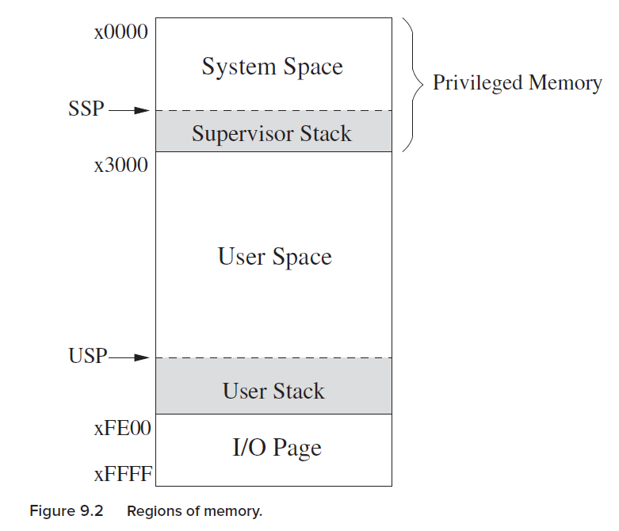

SSP: supervisor stack pointer; USP: user stack pointer, indicating top of the stacks. Only one is active at any one time. R6 is usually set as the pointer.

x0000 - x2FFF: privileged memory locations, System space. Contain data structures and code of the OS. Need Supervisor mode to access. 

x3000 - xFDFF: unprivileged memory locations, User space. Don’t need supervisor mode to access user space. Contain user programs and data.

xFE00 - xFFFF: used to identify registers relating to I/O functions and special registers. P654, KBSR, KBDR, DSR, DDR, PSR, MCR (Machine control register). These are I/O device registers.  Need supervisor mode to access.

Two registers, Saved_SSP and Saved_USP are used to save the SP not in use.

E.g., Privilege change from supervisor mode → user mode, then SP → Saved_SSP and Saved_USP → SP.

## I / O

### Memory Mapped I/O vs Special I/O

Special I/O: some computers use special I/O instructions.

Memory-mapped I/O: use data movement instructions (LD, ST) to transfer data between memory and GPRs. Device registers are assigned addresses from the memory address space. Those device registers (KBDR, DDR…) are mapped to a set of addresses that are allocated to I/O device registers rather than to memory locations. 

在memory中，专门留出一段地址用于device registers的标识映射，即I/O设备的registers被映射到一组地址。这些地址是分给I/O device registers的，不能再当成内存的位置用。（I/O专用位置）

LC-3 employs memory mapped I/O. In the I/O page of memory, there are ….. P654.

### Asynchronous vs Synchronous

I/O processes are much slower than processor. (asynchronous)

Synchronization mechanism: handshaking, ready bit. 

### Interrupt-Driven vs Polling

Interrupt-driven: the processor continue doing its own thing until being interrupted by announcements from the keyboard. (Keyboard controls the interaction).

Polling: processor controls the interaction. The processor interrogate the ready bit again and again until the processor detects that the ready bit is set, and then read the device register. 

### Input from the keyboard

KBDR: keyboard data register

KBSR: keyboard status register, KBSR[15] as ready bit

Keyboard input routine:

key struck → ASCII loaded into KBDR [7:0], setting KBSR[15] as 1 (indicating that there is something the processor should deal with) → LC-3 (processor) reads / loads KBDR, clearing KBSR[15] (KBSR[15] = 0 means the key struck has been processed) → another key struck….. (输入KBDR之后为1，处理之后为0. 为0的时候才接受key struck到KBDR中）

- Only when KBSR[15] == 0, key struck will be allowed. If KBSR[15] == 1, it indicates that there is a key being processing, disabling the keyboard.
- The processor only reads / loads data from KBDR when KBSR[15] == 1 to one of LC-3 registers.

For polling, the program repeatedly check the KBSR[15].

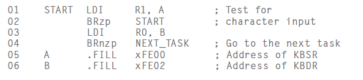

Only when negative (KBSR[15] == 1) can we load/read the KBDR into R0.

In memory-mapped Input, MAR is loaded with the address of the device register (instead of address of a memory location).

The address control logic would select the corresponding device register (DDR, KBDR) to provide input to MDR.

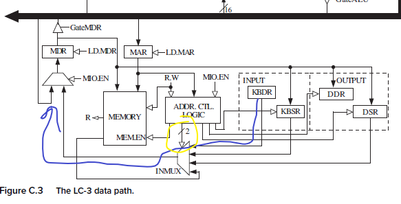

Address control logic controls whether MDR receive data from memory or KBDR/KBSR.

### Output to Monitor

DSR: display status register, DSR[15] …. ready bit to synchronizing the fast processor and slow monitor display.

DDR: display data register

Synchronization mechanism: 

LC-3 transfers an ASCII code to DDR for outputting → Clear DSR[15] → finishes the processing (displaying) → set DSR[15] → transfers to the monitor display.

（也是开始处理时为0，但在处理之后为1；对比KBSR在key进入KBDR为1，开始处理为0，处理完成也是0）

When DSR[15] == 1, another ASCII code would be transferred by the processor to the DDR for outputting.

When KBSR[15] == 0, another key struck would be loaded into KBDR, setting KBSR[15] = 1, processing begins.

Only when DSR[15] / KBSR[15] == 1, can the processor begins to input into registers (input, LDI) / output to the monitor (output, STI).

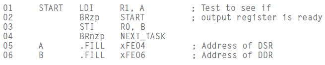

Compared to KBDR/KBSR.

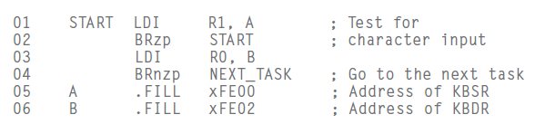

For memory-mapped output, 

- MAR ← address of a device register
- Address control logic enabling memory to write, asserts the load enable signal of DDR.

### Complete Picture of memory-mapped I/O

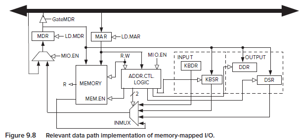

Address control logic: controls the Input or Output operation. 

Three inputs:

- MIO.EN: Whether a data movement is to take place in this clock cycle.
- R.W: indicates whether a load (memory or I/O → MDR) or store (MDR → written to memory or device registers) to take place.
- MAR: address of memory location or memory-mapped address of I/O device register.

## Operating System Service Routines (LC-3 TRAP)

### Trap Mechanism

P675

System Service Routines, having OS to execute some mission.

x0000 - x00FF (x0021, x0022, x0025…)

- System Space: x0000 - x2FFF
  
    

Trap Vector Table (LC-3)

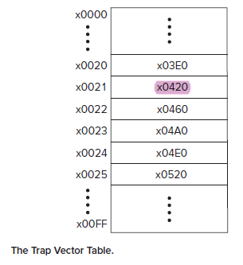

The TRAPx21 calls the output routine in x0420 (still in system space). x04A0: keyboard input service routine. x0520: halt service routine. 

## Trap instruction

- Change the PC to the address specified by the trapvector (zero-extended to 16 bits as an address)
- return, linkage back. PC contains the way back (next instruction).
- System call requires privilege mode switching. E.g., in User mode, a program asks TRAP and then: R6 → Saved_USP; R6 ← Saved_SSP.
- PSR[15] should be 0 to get privilege.

TRAP:

If user mode: switch user stack to system stack.

- Saved_USP ← SP; SP ← Saved_SSP
- Push PSR, Push PC + 1
- PSR[15] ← 0 (switch to privileged mode)
- PC ← MEM[0x00yy] (switch to trap vector table)

RTI: Return from Trap or Interrupt

If the processor is in User Mode (PSR[15] == 1), then initiate a privilege mode exception.

Otherwise, (in supervisor mode), pop two elements on the system stack into PC and PSR (SSP: R6). After PSR is restored, if the processor is running in User Mode, then: R6 → Saved_SSP; Saved_USP → R6 (switch from supervisor mode to user mode).

### Example, TRAPx21 (OUT)

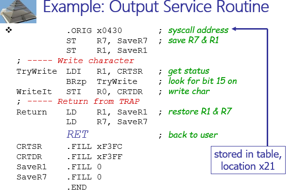

x0430, in system space, OS-related code / data structures.

RET: return from TRAP routine.

### Subroutine (function/procedure/method)

- In user mode
- invoked by another user program
- returns control to the calling program
- Similar to a service routine, but not part of OS.
- JSR / JSRR, save the address of the next instruction in R7 and go to subroutine
- RET: return from subroutine (JMP R7).

Save:

- Generally use callee-save, except for return values.
- You must save R7 if you call any other subroutine or service routine (TRAP)

### Library Routines

- .EXTERNAL
- use JSRR, because we don’t know how far we are from the library.

## Interrupts, Interrupt-Driven I / O

### Generating Signal

ready bit[15] (KBSR/DSR[15]) + IE[14]

IE[14], interrupt-enable. E.g., KBSR[14]

Only both ready bit and IE[14] is set, the interrupt is signaled.

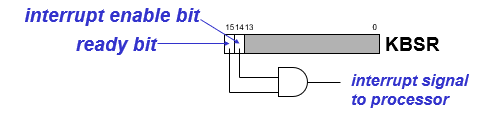

### Priority

PL0 - PL7

Priority encoder selects the highest-priority device, compared with the current processor priority level.

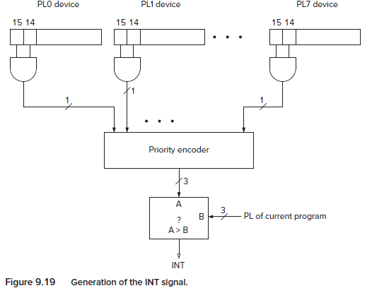

### INT signal

INT, Interrupt signal.

After the selection of the highest device PL, the processor would compare it with the PL of the current program. If device PL is higher, then INT signal is asserted. (Generate INT signal).

In instruction cycle, the next state depends on the INT signal. If INT is asserted, the next state would be handling the interrupt request instead of normal business.

### Handling the interrupt

Three stages:

- Initiate the interrupt
- Service the interrupt
- Return from the interrupt

1 **Initiate the interrupt:**

1) Save the state information of interrupted program: 

- PC, PSR (for LC-3)
- USP/SSP switch → PSR, PC pushed…

2) Load the state information of the Interrupt Service Routine. (Similar to Trap routine)

- I/O device generates Vectored interrupts (INTV, 8-bit): interrupt request signal + priority level
- Processor takes that INTV and expands it to 16-bit address, indicating the address in the Interrupt Vector Table (similar to Trap Vector Table) (x0100 - x01FF, each containing the start address of interrupt routine) (Interrupt request signal).

2 S**ervice the Interrupt**

…

**3 Return from the interrupt**

RTI (return from TRAP or Interrupt).

- PSR[15] switch, pop PC, PSR, …

### INT Example

You are running A and at this time device B sent its interrupt signal and accompanying interrupt vector xF2. When at the routine B, another device C called another interrupt routine.

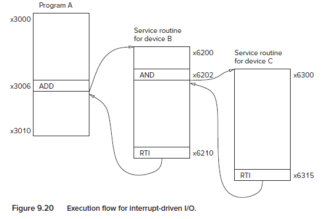

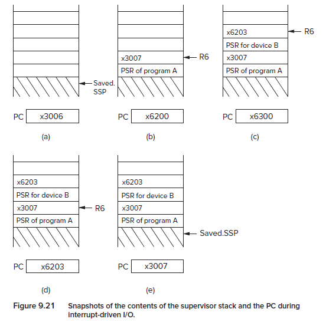

(a) Switch from user mode to supervisor mode. Saved_USP ← SP; SP ← Saved_SSP; PC is the next instruction to be executed.

(b) Pop PSR and PC of A (state information of A). The INTV is expanded as address and was loaded into PC. Execute that service routine. 

(c)…

(d) RTI, pop PC and PSR, restoring the state, including the condition codes for ADD/AND….

(e) RTI, pop twice, switch mode to user mode.

## Exception

Half (128) of the 256-entry interrupt vector table. x0100 - x017F.

They are handled as soon as detected. 

### 1 Privilege mode violation

Occurs when the processor attempts to execute the RTI instruction in User Mode.

### 2 Illegal opcode

Occurs when the processor attempts to execute an instruction with the unused opcode (1101).

### 3 ACV (access control violation)

The processor attempts to access privileged memory while still in User Mode.