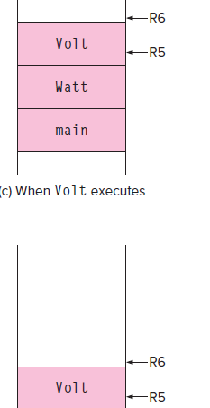
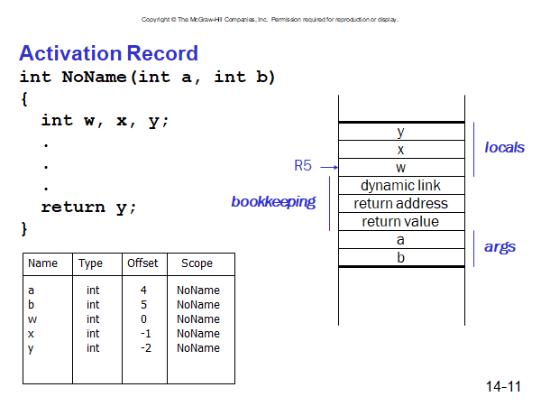

# Chapter 14 Function

## Run-time Stack

### Activation Record / Stack Frame

When a function is called, its stack frame / activation record is pushed onto the run-time stack. When it returns, its frame popped off the stack.

R5: frame pointer, points to the beginning local variables for the current function (activation record).

R6: stack pointer

R5, frame pointer, the first local variable.

Activation Record:

- arguments (from right to the left), transfers control
- Bookkeeping: Return value, return address (would be allocated even if “void”, copied into R7), dynamic link (put a copy of caller’s frame pointer in caller’s R5 to this dynamic link / caller’s frame pointer).
- Local variables. All of these variables are kept as offset by R5 (the first local variable)