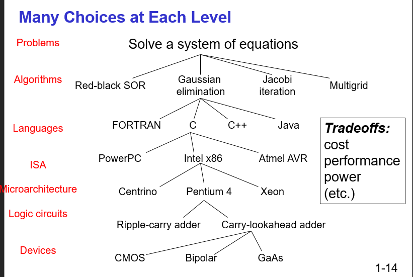

# Chapter 1 Introduction

Themes: abstraction; software & hardware interactions

Building computers from the bottom up:

Bits → logic gates → processor → instructions → C programming

### Turing Machine

1. All computers are capable of finishing the same task (computability) given enough time and memory. 
2. Theoretical / Mathematical model of a device that can perform any computation: Alan Turing. (Father of theoretical computers). Every computation can be performed by some Turing machine (Turing’s thesis).
3. Universal Turing Machine: A machine can implement all Turing machines (also a Turing Machine). part U is programmable; a computer can emulate a universal Turing Machine. A computer is a universal computing device.
4. In theory, computers can solve everything computable (given enough memory, time…). However, in practice it would be constrained by time, cost, memory, power,….

The first physical computer: 1940s, ENIAC (the Electronic Numerical Integrator and Calculator), by University of Pennsylvania.

### How to solve a problem?

- Problem
- Algorithm
- Program, express a problem by computer language
- ISA, specifies the instruction that a computer can perform.
- Microarchitecture (Implementation of ISA), different implementations of a single ISA.
- Logic Circuits, combine basic operations to realize microarchitecture
- Devices: properties of materials, manufacturability

### Important

1. Difference between ISA and microarchitecture: 

An ISA describes the interface to the computer from the perspective of the 0s and 1s of the program. For example, it describes the operations, data types, and addressing modes a programmer can use on that particular computer. It doesn’t specify the actual physical implementation. The microarchitecture does that. Using the car analogy, the ISA is what the driver sees, and the microarchitecture is what goes on under the hood.

(ISA, machine code; microarchitecture, actual physical implementation)

2.ISA specifies:

- Data type
- opcodes
- addressing modes
- memory address space