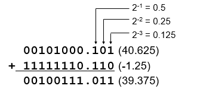
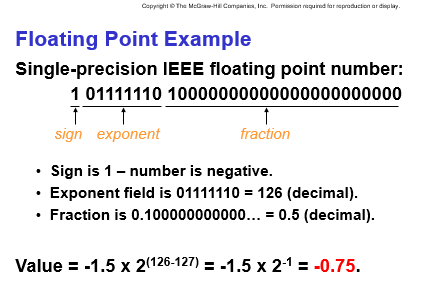

# Chapter 2 Bits, Data Types, and Operations

### bits

Computer is a binary digital system.

- digital: finite number of symbols
- binary: base 2, 0s and 1s

high voltage: 1; low voltage: 0

### signed integers

n bits, $2^n$ distinct values, $-2^{n-1} \sim 2^{n-1}-1$

The maximal positive 011…1 ($2^{n-1}-1$)

The minimal: 100..000 ($-2^{n-1}$)

negative integers (3 methods):

- sign-magnitude: sign bit, the most significant (MS) bit
- 1’s complement: flip every bit to represent negative numbers (problem: +0 and -0)
- 2’s complement (easy for arithmetic):

Note: ignoring carry out (overflow)

1) How to get the representation of a signed integer? -9

- get the positive version 01001 (9)
- flip → 10110
- +1 → 10111

2) How the get the decimal from binary representation? 11011

- flip → 00100
- +1 → 00101
- get the positive version → +5
- signing → -5

arithmetic operations: ADD, SUBTRACT, Sign Extension

logical operations: AND, OR, NOT

Sign Extension: replicate the sign bit

### Fractions: fixed-point

- binary point: separate positive from negative powers of two (similar to decimal point)

### Floating number

For very large or small numbers.

Scientific notation

1 (Sign) + 8 (Exponent, (exponent - 127)) + 23 (Fraction)

$N = (-1)^S* 1.fraction * 2^{exponent - 127}, 1 \le exponent \le 254$

$N = (-1)^S * 0.fraction * 2^{-126}, exponent = 0000 0000$

See P47.

### Logic operation

XOR: exclusive-OR

| A | B | A XOR B |
| --- | --- | --- |
| 0 | 0 | 0 |
| 0 | 1 | 1 |
| 1 | 0 | 1 |
| 1 | 1 | 0 |

DeMorgan’s Laws (relationships between AND and OR)

NOT(NOT(A) AND NOT(B)) = A OR B

NOT(NOT(A) OR NOT(B)) = A AND B

ASCII: American Standard Code for Information Interchange