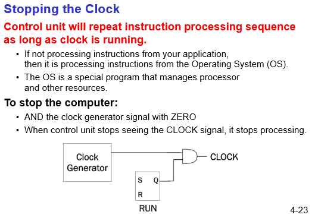

# Chapter 4 The von Neumann Model

## Overview

von Neumann Model

Theoretical Computer: Turing Machine

1943, the first physical / electronic computer, University of Pennsylvania

1940s, John von Neumann, proposed the basic computer model (von Neumann Machine)

Components: see P126

- Memory: contain instructions and data, MAR + MDR
- Processing Unit: performing arithmetic and logic operations, ALU (LC-3, ADD, AND, NOT) + TEMP (registers for storing temporary values)
- Control Unit: for interpreting instructions, PC + IR
- Input: disk, keyboard (can act in LC-3), scanner, mouse
- Output: disk, monitor (can act in LC-3), printer, LED

disk belongs to input/output!!!!

von Neumann Model:

Processing Unit (ALU, TEMP), Control Unit (PC, IR), Memory (MAR, MDR), Input (disk), Output

## Memory

### Size of memory

$2^{10} bit = 1024bit = 1K$

$2^{20}bit = 1024K = 1M$

$2^{30} bit = 1024 M = 1G$

A $2^{34} - by - 8 bit$ memory computer:

Address space: $2^{34}$ uniquely identifiable locations, 16 G

Addressability: 8 bits (1 byte) stored in each location

LC-3: $2^{16} -by-16 bit$

So, there are totally 16 bits to indicate the address, 16 bits per location (length of instructions)

### Interface / Communication between Memory and Processing Unit

MAR: memory address register

MDR: memory data register

To read contents of a memory location:

1. Place the address into MAR
2. Interrogate the computer’s memory / send a read signal to the memory
3. Put the data / information in that location into MDR.

To write / store a value in a memory location:

1. Write the address of that location into MAR
2. Write the value to be stored into MDR
3. Interrogate the memory with WE asserted (send a write signal to the memory.
4. Then the information contained in MDR will be written into the memory location specified by the value in MAR.

## Processing Unit

The processing unit carry out processing of information in the computer. 

### ALU

Arithmetic and Logic Unit, the simplest processing unit

Function: performing base arithmetic functions (ADD, SUBTRACT) and base logic operations (bit-wise AND, OR, NOT).

The ALU of LC-3 can perform: AND, NOT, ADD.

Word size: ALU processes data elements (words) of a fixed size (word length). E.g., ALU receives two words as two inputs and output one word. Most microprocessors have a word length of 64 bits (64位处理器) or 32 bits. A 64-bit processor refers to **a microprocessor that can process data and instructions in chunks of 64 bits.**

For LC-3, ALU processes 16-bit words (word length = 16).

### Registers

Temporary storage. It’s faster to access temporary storage than to access memory locations. Typically, each register contains one word (= word size). For LC-3, there are 8 general purpose registers. 

## Input & Output

Including disk!!!!!!!!!!!!!

Devices for getting data into or out of the computer memory.

Input: disk, keyboard, mouse, scanner;

Output: disk, monitor, LED, printer

Each device has its own device register (similar to MAR and MDR), own interface.

LC-3 support keyboard (input) and monitor (output).

Keyboard: KBDR and KBSR

Monitor: DDR (display data register) and DSR (display status register)

Driver: programs that control access to a device (including I/O, 设备的驱动程序).

## Control Unit

Including PC and IR (in von Neumann Model). Reading an instruction from memory. Keeping track of where we are in the processing of the program / instruction. 

IR (instruction register): contains the current instruction.

PC (program counter): contains the address of the next instruction to be executed. 

## Instruction

### ISA (instruction set architecture)

All of a computer’s instructions and their formats. It acts as an interface between software and hardware. E.g., x86

ISA specifies:

- Opcode
- Operand
- Addressing modes

### Types of instructions

- Operate instructions: ADD, AND…
- Data movement instructions: LD, ST…
- Control instructions: BR (conditional), JSR, JMP (unconditional)

## The instruction cycle

- FETCH
- DECODE
- EVALUATE ADDRESS
- FETCH OPERANDS
- EXECUTE
- STORE RESULT

The instruction cycle is controlled by a synchronous finite machine. 

### FETCH

Load the instruction from the memory. 

- MAR ← PC; PC ← PC + 1;
- MDR ← M[MAR]
- IR ← MDR

### DECODE

- Identify the opcode (a 4-to-16 decoder asserts a control line corresponding to the desired opcode line).
- Depending on the opcode, identify other patterns from the remaining bits.

### EVALUATE ADDRESS

Only for those instructions that require memory access (compute address used for access).

E.g., LDR, add offset to base value of a register

Note: Some instructions such as ADD, AND, NOT don’t need this part because they only effect among registers.

### FETCH OPERANDS

Obtain source operands for operation. 

- load data from memory location (LDR). In LD, 1) loading MAR with the address calculated in the EVALUATE ADDRESS phase and 2) reading memory,  place that source operand value into MDR.
- read data from registers (ADD).

### EXECUTE

Perform the operation using the fetched operands.

E.g., add the value of SR1 and SR2 (send operands to ALU and specifies ADD by the ALUK control signal (from finite state machine))

Note: load and store will do nothing in this stage.

### STORE RESULTS

Store the results of execution to the destination (memory or register). 

E.g., result of ADD is placed in destination register; result of memory load is placed in register; result of ST is placed in the memory location (write address to MAR, data to MDR, write signal asserted to memory).