# Chapter 5 LC-3

## ISA

ISA Tells programmers how to write machine language.

- memory organization: address space, addressability
- register set: how many, size?
- instruction set: xxxx

instruction set specifies: 

- opcodes (describe the operation)
- addressing modes (figure out where the operands are located)
- data types (acceptable representations for operands)

instruction:

- opcode
- operand

## Overview

LC-3: memory $2^{16} -by-16 bits$

address space = 64K, addressability = 16 bits (size of each memory location)

Registers: TEMP, temporary storage (access time of registers is much shorter than that of memory)

GPR (general purpose register): R0-R7, 3-bit to identify their number, each 16 bits wide

Opcodes:

- Operate instructions: ADD, AND, NOT
- Data Movement instructions: LD, LDR, LDI, LEA, ST, STR, STI
- Control instructions: BR, JSR/JSRR, JMP, RET, RTI, TRAP

Condition code setting instructions (these instructions write values into registers, based on the last instruction that altered a register): LD, LDI, LDR, ADD, AND, NOT

Data type:

16-bit 2’s complement integer

Addressing mode:

- PC-relative (LD)
- BaseR + offset (STR)
- Immediate (ADD)
- Indirect (LDI)
- Register (ADD)

## Operate instructions

ADD, AND, NOT

### NOT

In the processing unit

ALU + REG FILE (TEMP)

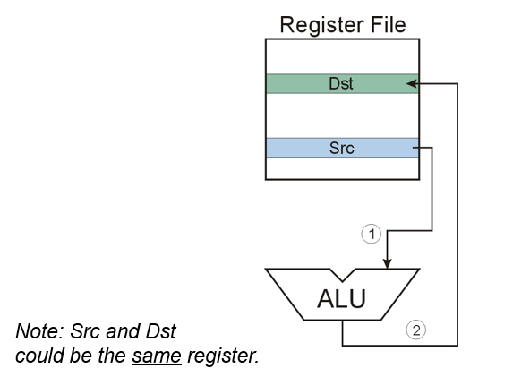

P704, REG FILE (src) → SR1 OUT → ALU → GateALU → Processing bus → REG FILE  (dst)

### ADD / AND

(DR, SR1, SR2)

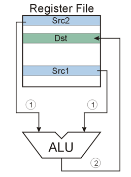

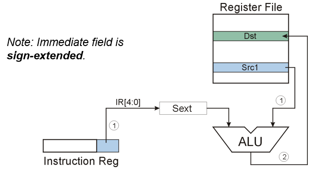

See P704, SR2MUX is selected by IR[5], specifying whether use imm5 or SR2.

## Data Movement Instructions

The location of the destination operand is over written with the source operand. 

- load
- store
- LEA

### load

data: register ← memory

LD: PC-relative, PCoffset9, $-256 \le offset9 \le +255$, 

LDR: base + offset

LDI: indirect, read address from memory location and load / store that address

Note: PC incremented is done in FETCH, which is before the EVALUATE ADDRESS stage.

LD:

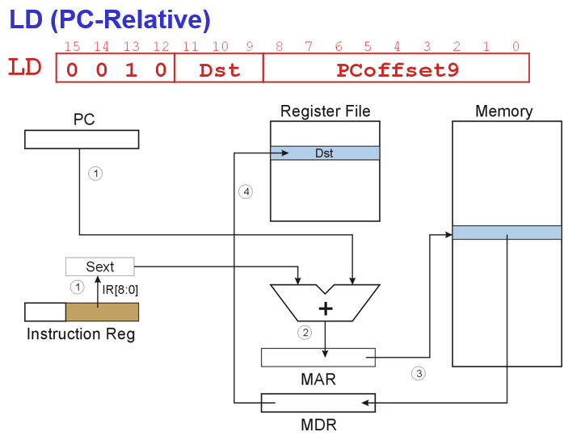

P704, IR → SEXT[8:0] → ADDR2MUX + ADDR1MUX (PC) → MARMUX → GateMARMUX → MAR → Memory → MDR → GateMDR → REG FILE (dst) + condition code

LDI:

IR → SEXT[8:0] → ADDR2MUX + ADDR1MUX (PC) → MARMUX → Processor Bus → MAR → Memory → MDR (for this time, it contains an address (value) for the next interrogate) → GateMDR → processor bus → MAR (that value as the new address) → Memory → MDR → GateMDR → processor bus → REG FILE

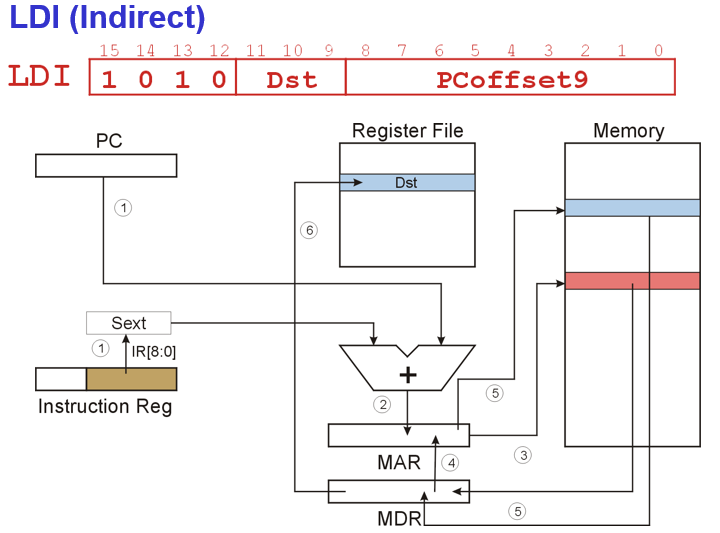

### LDR

IR → SEXT[5:0] → ADDR2MUX + ADDR1MUX (SR1, instead of PC) → MARMUX → GateMARMUX → processor unit → MAR → Memory → MDR → GateMDR → REG FILE (DR)

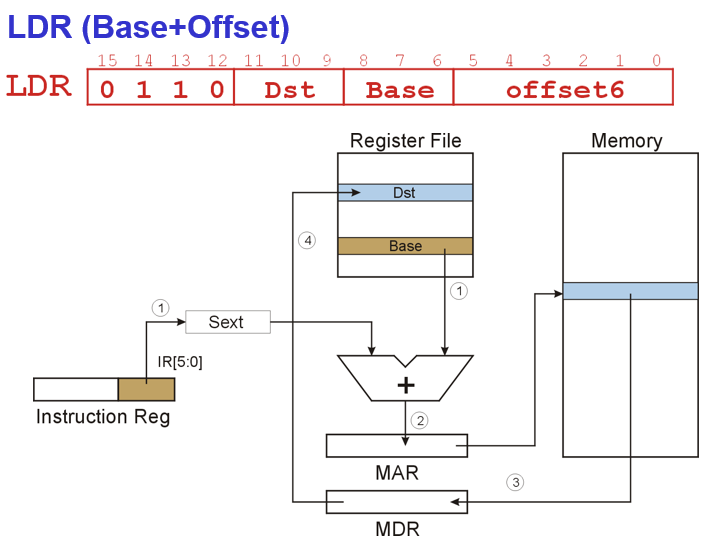

### store

data: register → memory

ST: PC-relative

STR: base + offset

STI: indirect

Note: to store a value in a memory location, you should have both the address (in MAR) and the value (in MDR).

ST:

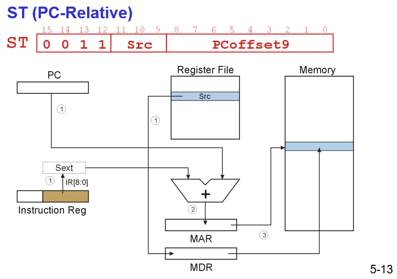

Compared to LD, the MDR is reversed. 

STI: P704

IR → SEXT[8:0] → ADDR2MUX + ADDR1MUX (PC) → MARMUX → GateMARMUX → Processor bus → MAR → Memory → MDR → Processor bus → MAR (as an address to store the value) 

Src → MDR 

Access the memory and write that value in MDR to that memory location.

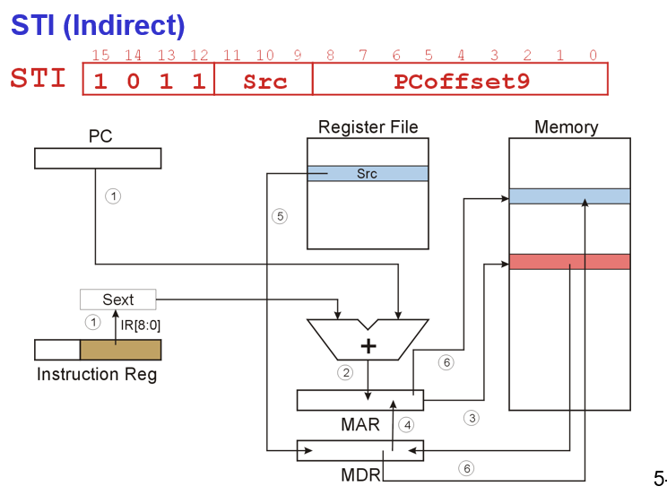

STR:

IR → SEXT[5:0] → ADDR2MUX + ADDR1MUX (BaseR) → MARMUX → GateMARMUX → processor unit → MAR → Memory

Src (REG FILE) → 

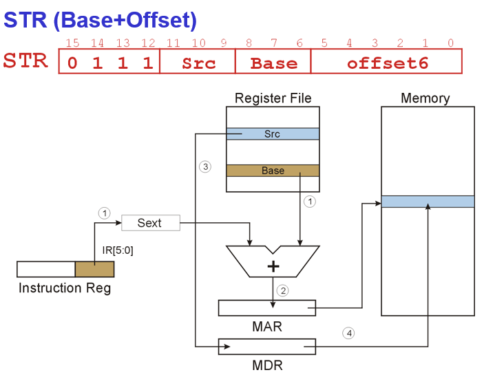

### LEA

Load effective address, load / compute the address (specified by PCoffset9) value and store the value into DR.

It doesn’t read memory and doesn’t set condition codes. (No MAR and MDR)

It is not added in ALU. ALU only implements operation (ADD, NOT, AND) from REG FILE or immediate number.

IR → SEXT[8:0] → ADDR2MUX + ADDR1MUX (PC) → Get the effective address → MARMUX → GateMARMUX → processor bus → REG FILE (Dst)

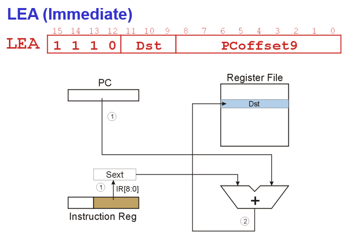

## Control Instructions

### TRAP

service call, the called service routine is specified by trapvector8

- Changes PC to the address of an OS “service routine”
- routine will return control to the next instruction after TRAP (e.g., IN)

### BR

Conditional branch

Take condition code registers’ value as control signal of PCMUX 

The address of the next instruction PC = PC (has incremented) + offset9

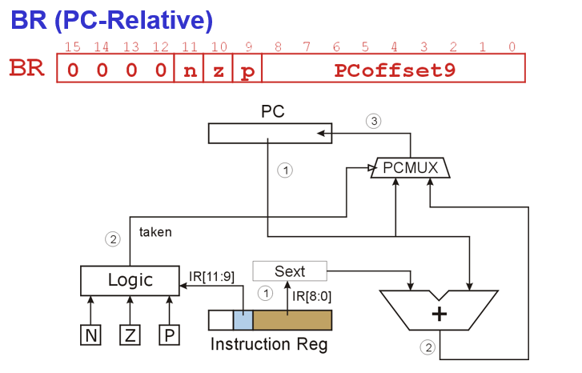

Methods of loop control:

- Counter
- Sentinel

### JMP

REG FILE → SR1 OUT → ALU → GateALU → processor bus → PCMUX

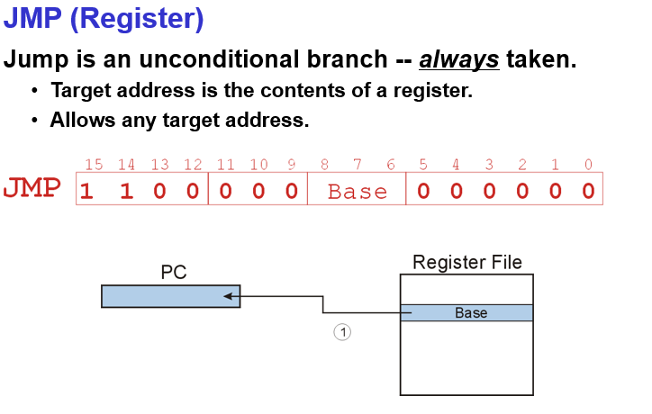

## Data Path (Revisited) P175

### Global Bus

Consist of 16 wires, allowing one structure to transfer up to 16 bits of information to another structure. Exactly one value (word) can be transferred over the global bus. 

Any components can read the global bus.

Tristate device: The input arrow into the global bus always follows a not filled-in triangle, allowing the computer’s control logic to enable exactly one supplier to provide information to the bus at any one time. See GateMARMUX, GateMDR… in P704.

Register only captures the data from the global bus if it’s write-enabled by the control unit. 

The structure wishing to obtain the value being supplied can do so by asserting its LD.x (load enable) signal (similar to write enable in Gated D Latch).

See LD.REG, LD.PC, LD.MDR, LD.MAR… in P704.

### Memory

- Memory is accessed by loading the MAR with the address of the location to be accessed. Then control signals reads the contents of that location and the result of that read is delivered by the memory to the MDR.
- M[MAR] in memory locations → control signals → delivered to MDR by the memory.
- Store: what is to be stored is loaded into the MDR. Then control signals asset a write enable signal in order to store the value contained in MDR in the memory location specified by MAR (so, MDR and MAR both point to the memory).
- The value to be stored → MDR → write enable signal (LD.MDR) → store the contents in MDR into the address specified in MAR ← MAR (LD.MAR)

### ALU

AND, ADD, NOT (in LC-3)

ALU only accepts values from REG FILE (SR1, SR2) or SEXT immediate numbers(SR2). 

Which to choose is determined by select line of the SR2MUX (IR[5], control signal).

### Register File

Two read addresses (SR1, SR2), one write addresses (DR).

Input only from global bus (from ALU / REG FILE or memory read (LD)).

Data for storing in the memory passes through ALU. 

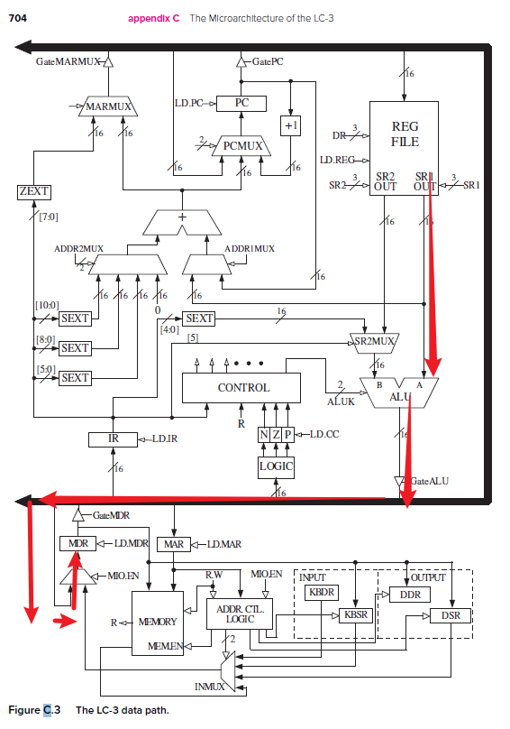

STR, store the value of the register into MDR, then into memory.

### PC, PCMUX

(MAR ← PC) At the start of each instruction cycle, PC is supplied to MAR over global bus.

PCMUX: (left to right)

- TRAP (from the global bus)
- JMP, BR (from address adder, like PC + offset9, not ALU)
- PC increment

### MAR, MARMUX

Two inputs:

- ZEXT, trapvector, system call, TRAP
- Special address adder, PCoffset, BaseRoffset… including ADDR2MUX and ADDR1MUX.

### Condition Code Logic

Looks at value on the bus to determine N, Z, P.

Only set when [LD.CC](http://LD.CC) enables them (instructions: LD, LDI, LDR, ADD, AND, NOT)

### Control Unit - Finite State Machine

Provide control signals for the machine cycle.

- Who drives the bus? GateMARMUX, GateALU, GateMDR
- Which register is write enabled? LD.CC, LD.MDR, LD.REG
- Which operation can ALU perform? ALUK…
- …

Load enable (LD.REG…) is aimed at registers. 

## Instruction Cycle of LC-3

- FETCH: MAR ← PC, PC ← PC + 1; MDR ← M[MAR]; IR ← MDR
- DECODE:
- EVALUATE ADDRESS: e.g., ADDR1MUX + ADDR2MUX (address adder)
- FETCH OPERAND: MAR - operand address in the memory location; MDR - value of the operand (operand fetch)
- EXECUTE: E.g., ALU (ADD, NOT, AND)
- STORE RESULT: store the result into the destination. E.g., store the result of ALU in the Register (ADD), or load the value in MDR in GPR. Setting the condition code.

Note: ADD, AND, NOT don’t need EVALUATE ADDRESS; LD, LDI, LDR don’t need EXECUTE.