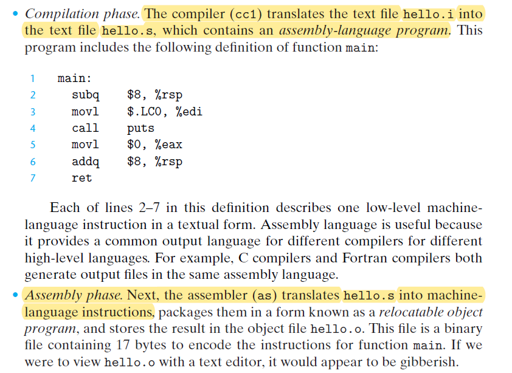
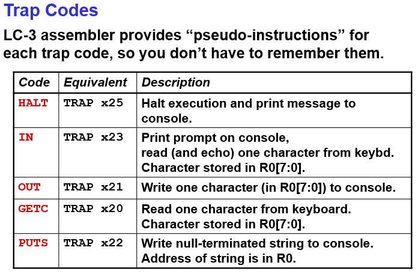
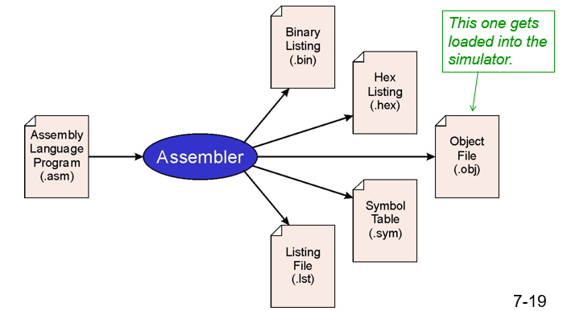

# Chapter 7 Assembly Language

## Overview

Assembler: Convert assembly language into machine instructions (codes). Assembler is ISA-specific (e.g., LC-3 assembly, x86 assembly)

Compiler: Convert high-level programming language into machine instructions. High-level language is ISA-independent. 

See CSAPP P41

## Symbolic Name (labels)

Placed at the beginning. Used to identify memory locations. Give a symbolic name to a memory location (address). 

- As a target of branch. AGAIN in the example
- As values stored / loaded in that location. E.g., NUMBER, SIX.

### Pseudo-ops (assembler directives)

- They are not operations executed by the program
- Used by assembler
- Starts with dot

- .ORIG x3000 ; Set the starting address of the program as x3000. Tells the assembler where in memory to place the LC-3 program.
- .END ; End of program. Telling the assembler where the assembly language program ends.
- .BLKW ; Block of words, set aside some number of sequential memory locations in the program.
- .FILL x00FA; allocate one word, initialized with value n
- .STRINGZ “Power Overwhelming”; n-character string, allocate n + 1 memory locations, initialized with characters within the quotes and a terminator. The characters should be zero-extended ASCII codes. x0048 - ‘H’

## Operands

### Registers

R0 - R7 (LC-3)

### Numbers

- Binary: b1032
- Decimal: #3
- Hexadecimal: x38FA

## Assembly Process

Convert assembly language file (.asm) into an executable file (.obj, machine code) for the LC-3 simulator.

Assembly program → 1st pass (scan the program file, finding all labels and their corresponding addresses (called the symbol table) → 2nd pass (Convert instructions to machine code using information from the symbol table) → executable image

### First pass: constructing the symbol table

It assumes that the entire program exists between .ORIG and .END pseudo-ops. 

LC (location counter): keep track of the location assigned to each instruction by LC. It works during assembling. 

The assembler examines each instruction (non-empty line) in sequence and creates a symbol entry (including label name and its address in LC) if a label is met. 

### Second pass: generating the machine language program

Translate the assembly language instructions into LC-3 machine language instruction. 

See P243, the object file

.ORIG, the address will be put in the first line of the object file

Note: the value of PCoffset is computed by the address of label in the symbol table and the address of the current instruction (PC). You translate the value of PCoffset instead of the value of label address itself. 

Note: object file includes the starting address (.ORIG) and machine codes of instructions.

## After Assemble

You will get some list files, symbol table (.sym), and the object file (which will be loaded into simulator)

### Linking

- Resolving symbols between independent object files. Then you may use a symbol defined in another module. Linker will search symbol tables of other modules to resolve symbols and complete code generation before loading.
- .EXTERNAL, specifies a symbolic name of an address which is not known yet. It tells the assembler that a symbol is defined in another module.

### Loading

Loading: the process of copying an executable image into memory. Loaders would relocate images to fit into available memory. 

LC-3 simulator can load multiple object files into memory. 

- System routines such as INPUT, are loaded automatically into “System Memory” below x3000.
- User code should be loaded between x3000 and xFDFF.
- Each object file includes a starting address.